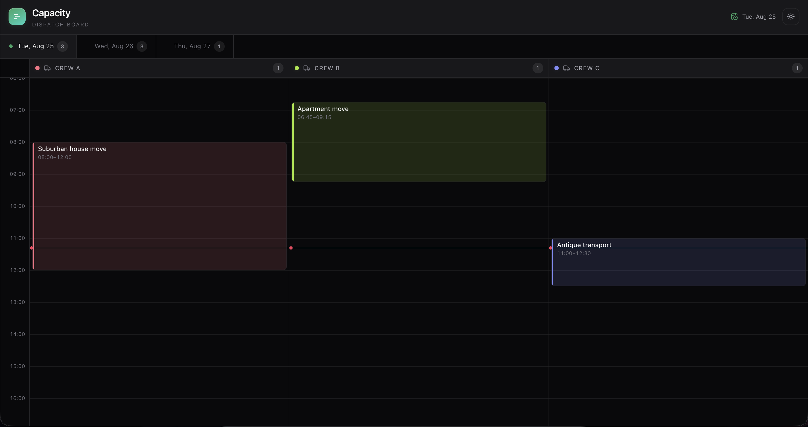

# capacity



A small dispatch board: crews and trucks as columns, jobs scheduled
inside time windows, draggable between crews and between days — by mouse,
touch, **or keyboard** (arrow keys move a picked-up job, `Tab`/`Shift+Tab`
switches days mid-drag, none of it turned off to make the mouse path
easier). Built to prove one thing end to end: what happens when the
server, not the client, decides who gets a scheduling slot, and the
client actually recovers when it guessed wrong.

It's a personal project, not a product. **Live:
[capacity-crew.vercel.app](https://capacity-crew.vercel.app/)** — the API
runs on Railway's free tier, so the first request after a period of
inactivity can take 10–20s to wake it up; a reload once it's warm is
fast. See [docs/GOAL.md](docs/GOAL.md) for what it's for and why
moving-company dispatch is the example domain, and
[docs/DECISIONS.md](docs/DECISIONS.md) for the architectural reasoning,
alternative approaches dropped, and why.

## Stack

Next.js, Apollo Client, and dnd-kit on the frontend; Flask, Graphene, and
SQLAlchemy on Postgres for the API. The full breakdown, folder structure,
and the rules the code follows live in [CLAUDE.md](CLAUDE.md).

## Running locally

```bash
docker compose up -d postgres
npm install
cd apps/api && uv run python seed.py && cd ../..
npm run dev
```

The board opens at http://localhost:3000. No `.env` file is required for
this: `docker-compose.yml` maps Postgres to `localhost:5434`, and that's
already the default both apps fall back to when `DATABASE_URL` /
`NEXT_PUBLIC_API_URL` aren't set (see `apps/api/.env.example` and
`apps/web/.env.example` if you do need to point at something else, like a
non-default port or a deployed API).

## Testing

```bash
npm test                             # vitest + pytest
npm run test:e2e --workspace=web     # playwright
```

`apps/api`'s tests run against the same local Postgres as `npm run dev`
(there's no separate test database), and every test's teardown deletes
all crews and jobs to start the next one clean. Running `npm test` after
seeding for manual exploration wipes that seed data — the board you had
open goes empty, not broken. Reseed (`cd apps/api && uv run python
seed.py`) to get it back.

The full pyramid, what each layer covers, and the five non-negotiable
tests are documented in CLAUDE.md's [Tests](CLAUDE.md#tests) section.

## Reproducing the concurrency conflict

There's no WebSocket, subscription, or polling in this project. The
server is the only source of truth on scheduling conflicts, and the
client finds out it guessed wrong only when it tries to save (ADR-006).
These steps reproduce that by hand. `apps/web/e2e/concurrency-conflict.spec.ts`
automates the same scenario with two Playwright browser contexts.

1. Seed the database if you haven't already (`cd apps/api && uv run
   python seed.py`), then open two browser tabs at
   http://localhost:3000, both on today's date.
2. In the first tab, drag "Storage pickup" (Crew A) into an empty slot
   late in the afternoon on Crew B — you may need to scroll the column to
   reach it, since a day is a full 24h tall. Confirm the move: no toast
   should appear, and the block should land on Crew B.
3. Don't reload the second tab. Its Apollo cache still reflects the
   board from before the first tab's move, so Crew B's afternoon still
   looks empty to it.
4. In the second tab, drag "Piano delivery" (Crew C) into that exact same
   slot on Crew B. While dragging, the local collision preview shows no
   conflict, since the second tab has no way to know the first tab
   already took it.
5. On drop, the second tab gets a "Move rejected" toast naming "Storage
   pickup", and "Piano delivery" snaps back to Crew C. That rejection
   came from the server, not the second tab's own stale prediction.
6. Reload the second tab. The board now agrees with the first: "Storage
   pickup" is on Crew B, "Piano delivery" never moved.

If the server's conflict check were removed or weakened, step 5 would
silently succeed instead, which is exactly what
`concurrency-conflict.spec.ts` asserts against.
